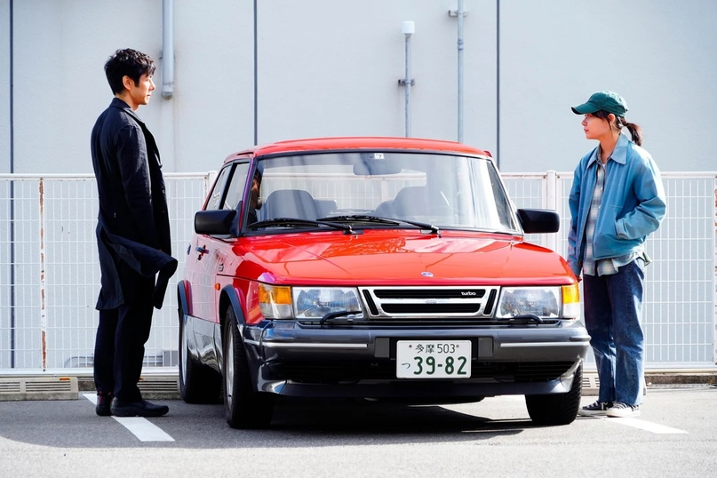
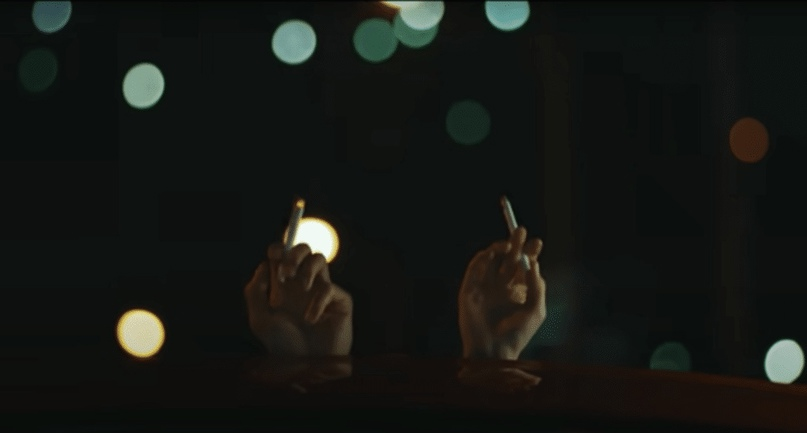

# Обзор «Сядь за руль моей машины»

## Синопсис фильма:
Действие фильма происходит в Японии, фильм повествует о невзгодах актёра и режиссёра театра ― Юсукэ Кафуку, из-за смерти его жены сценаристки ― Ото Кафуку. После её смерти, в память о ней Юсуке каждый день, на своей любимой ярко-красной машине переслушивает аудио-кассету с записью пьесы А.П.Чехова «Дядя Ваня», озвученной его женой.

По-иронию судьбы Юсуке предлагают поставить эту же пьесу для театрального фестиваля в Хиросиме, а также по-правилам ему запрещено водить свою машину, поэтому ему предоставляют девушку-водителя — молчаливую Мисаки. На протяжении постановки пьесы Юсуке будет переосмыслять свои отношения с женой.

<aside>🎬 Фильм основан на рассказе Харуки Мураками "Мужчины без женщин"</aside>

## Основные темы

- Любовь и утрата
- Искусство и творчество
- Прощение и принятие
- Поиск истины в человеческих отношениях

## Почему его стоит посмотреть? (без спойлеров)
Сюжет фильма меня сильно затронул и дал подумать о своей жизни, из-за того, что показаны разные остросоциальные проблемы современного общества, точнее японского общества и о её переживаниях.

Особенно этот фильм будет интересен тем, кому интересно, почему японцы не проявляют эмоций и узнать о чём же они думают, одним из ответов будет, что они ценят человека по существу, но они этого не показывают, так как им не нужно много слов чтобы проявить уважение/любовь к человеку.

В фильме чувствуется проблема одиночества в Японии, и то, как люди не могут понять друг друга.

Фильм довольно меланхоличный и медитативный, поэтому этот фильм стоит смотреть в располагающем для этого настроении.

Сюжет может показаться довольно растянутым, всё из-за того, что рассказ, из сборника «Мужчины без женщин» Харуки Мураками на котором основан фильм, довольно короткий, если вы его читали, то советую посмотреть этот фильм, не зря его номинировали на премию «Оскара» за лучший адаптированный сценарий.

В этом фильме так же не забыли про страшную ядерную бомбардировку Хиросимы, так как пьеса, которую должен поставить главный герой должен пройти в Хиросиме и пьеса должна быть интернациональной, в фильме появляются представители Китая, Южной Кореи и актриса общающаяся языками жестов.

Я мог бы больше рассказать про сюжет фильма, но не могу, потому что этот фильм прекрасен тем, что зритель сам должен посмотреть и заметить разные детали.

Визуал у фильма просто шикарный, я буквально не мог оторваться от экрана на протяжении всего фильма, так как камера охватывает много живописных мест.

Актёры тоже хорошо отыграли свои роли.

Камера оператора берёт во второй план города, моря, горы и лес, ― основной план часто берёт ярко-красная машина Юсукэ, ― ещё хотелось бы отметить удивительные дороги Японии, по сравнению с нашими дорогами они выглядит как небо и земля, в общем, обзавидуешься.

Мне фильм понравился, хоть я и обычный зритель, который только и читает разборы фильмов. Для меня этот фильм оказался испытанием, так как до этого мне не приходилось использовать все свои знания на практике. До недавнего времени я лишь бездумно смотрел основные действия фильма, это было обусловлено привычкой, которая развилась из-за раннего возраста просмотра фильмов, естественно тогда я ничего не мог подметить.

В колонке про впечатление от фильма я подробнее расскажу о своих эмоциях, а пока идите смотреть фильм

## Разбор фильма (со спойлерами):

Я в начале статьи не рассказал о главной детали фильма, что сценаристка и жена Юсукэ ― Ота Кафуку изменяла своему мужу, и то, что она творческая личность. Ота на протяжении своей сюжетной линии рассказывала разные истории во время любовных утех, потому что во время неё у неё появляется вдохновение. Как вы могли заметить истории имели смысл, давайте разберём каждую историю:

>История про пиявку и непиявку была про то, что пиявки отродни присасывались друг к другу (видимо Ота сравнила свою семью с другими семьями) и только одна непиявка решила присосаться к камню(?), непиявка хотела бы иметь более динамичную жизнь как у других пиявок(не знаю почему), но она так и лежала с камнем, с течением времени всё начинает забываться и она умирает. ― видимо Оте не нравится жизнь с Юсукэ из-за того, что жизнь остановилась после смерти её дочери.
История про школьницу и грабителя была про то, что школьница не могла признаться одному школьнику в том, что она его любит, но она постоянно к нему заходила и играла, но в один день она замечает, что в доме школьника заявился грабитель, заметив это она убивает его, она сбегает но её гложет вина и боится что убийство повесят на её возлюбленного, поэтому она решилась пойти и рассказать обо всём этом ему. Но она заметила, что к нему не только не приехали полицейские, так там ещё и стоит камера перед входом, заметив это она стала повторять, что это она убила грабителя, стоя около двери. ― я конечно тут немного на придумал, но история ясна. Это аллегория на то, что Юсукэ не смог высказаться по поводу измены Оте. В конце видимо она пыталась достучатся до него, но безуспешно.
>

На самом деле отношения, которые хотел спасти Юсукэ и так трещали по швам, так как история, которую она рассказала любовнику заканчивала сценарий Юсукэ, но он также был незакончен. Она хотела поговорить с Юсукэ вечером, но Юсукэ в тот день специально пришёл поздно, так как он боялся скандала, если идти по сценарию, видимо она хотела признаться в содеянном и разорвать с ним отношения.

Как писал один кинокритик, Юсукэ на протяжении всего фильма имел 3 стадии принятия этой ситуации, лучше него я бы не смог описать:

>Первая - творческий союз. Во время секса она нашептывает ему истории, которые позже превращаются в сценарии. Утром она не помнит ничего, а он трансформирует рассказы в пьесы. Параллельно этому жена изменяет главному герою, но тот, зная об этом, не рушит хрупкую связь. Несмотря на предательства, нет даже сомнений во взаимной любви.
Вторая - боль потери. Жена внезапно умирает от кровоизлияния в мозг. Все, что остается у режиссера, аудиозаписи с ее голосом, которые он каждый день слушает в своей красной машине.
Наконец, третья - мир без женщины. У жизни нет иного смысла кроме той самой красной машины и голоса жены на аудиокассетах. Умирающее творчество и бесконечная рефлексия в собственной голове.
>

## Впечатления от фильма(со спойлерами):
Я довольно впечатлительный человек, так как мне только-только будет под двадцать, этот раздел статьи я бы хотел сделать более лёгким и эмоциональным.

Я ничего не ожидал от этого фильма, я знал, что японцы снимают довольно странные и непонятные фильмы. Да и про японцев я знал, чисто по их игро-аниме индустрии, оказалось фильмы тоже такие же странные, как и они сами, но более приземлённые. Но узнав, что «Сядь за руль моей машины» взял оскар, я решился его посмотреть.

Оказалось, он действительно хорош, но я честно совсем не ожидал, что Юсукэ будет изменять его жена, совсем, я даже чуть не вышел из сеанса, насколько страшные для меня это было событие. Но я взял себя в руки, и я стал заворожённо всматриваться в каждое действие в фильме, чтобы понять, почему она ему изменила.

Мне ещё понравилась ярко-красная машина главного героя Юсукэ, он мне казался интересным, так ещё и это убираемое сиденье, фантастика! Мне ещё понравились японские дороги, они были очень красивыми. Сюжет тоже понравился, не без греха, конечно, но последняя треть фильма раздавливала тебя последними кусочками пазла в понимании действий Оты.

Честно я не понимал любовника Оты, он был плохо отыгранным даже как персонаж фильма, но блин, то, как это перевернули в сцене диалога на машине, это просто нонсенс!! Так ещё и мощный удар об реальность, когда во время подготовки пьесы в театре его поймали и заключили под стражу, шокирующе.

Вообще я бы хотел рассказать о многих деталях фильма, но так как это был мой первый обзор вообще, и так как он стал слишком длинным, я на этом закончу, удачного вам дня!

